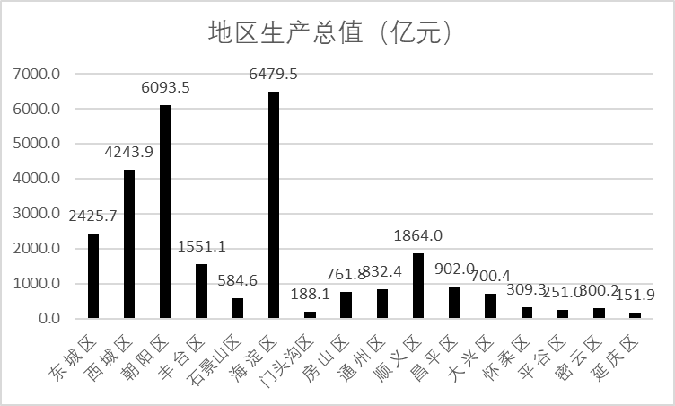
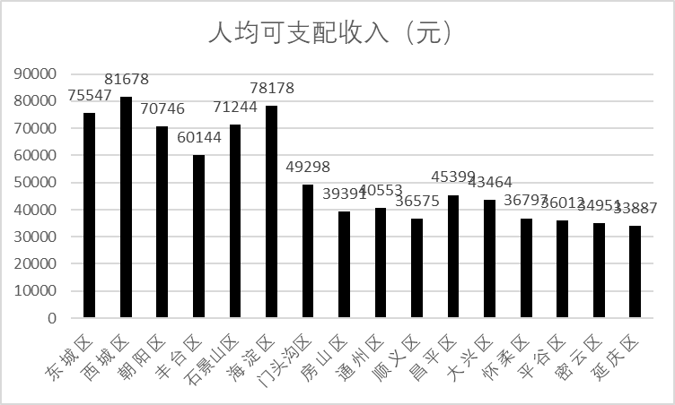
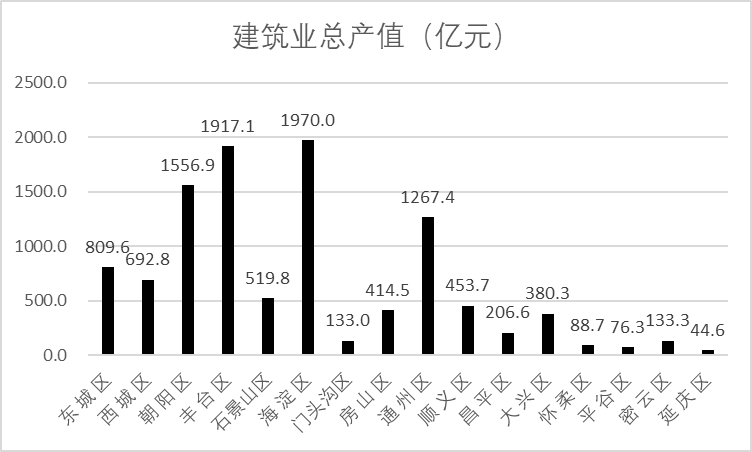
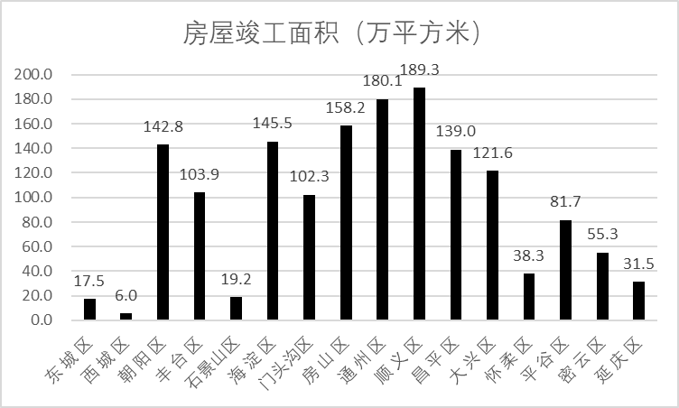
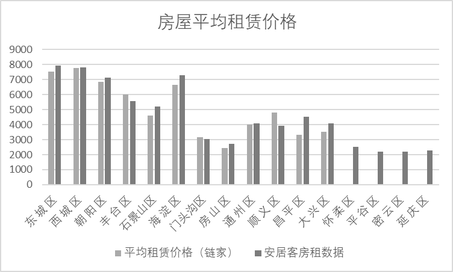
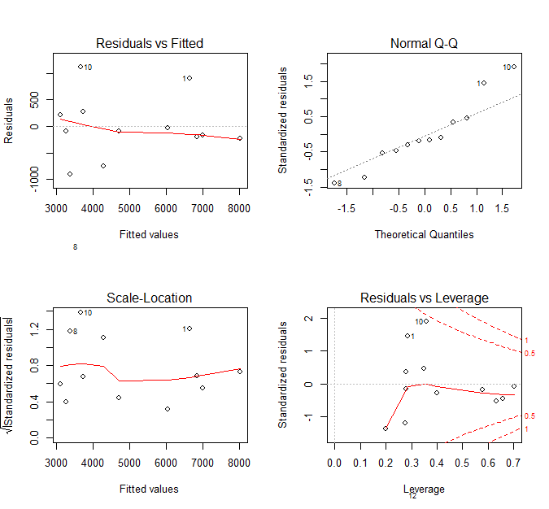
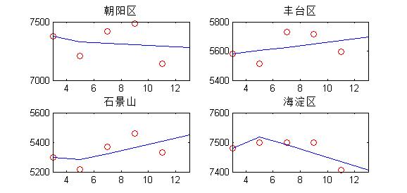

# 基于多元统计模型的北京市房屋租赁价格研究

## 摘 要

*待论文完成时修改此部分*

房地产产业是有关国民经济发展的重要产业，租房价格问题与民生问题息息相关，近年来我国房价不断攀升，租房问题也成为全社会关注的焦点问题之一，因此研究租房价格模型并进行预测，有一定必要。本文选取北京市各城区，从这些城区近年的平均租价和影响租价的因素和居民人均可支配收入，土地价格，房地产税，开发商预期利润等进行分析，得出各城市近年的理想租价，并通过与实际租价的对比，对租价的合理性进行定量分析，再利用多元回归模型和灰色模型，对未来租价走势进行预测，得到预测函数，并利用统计方法找出影响租价的主要因素，得到使租价合理的具体措施，再通过对租价变化与房价、GDP关系变化的定量分析，得出房价对经济发展的影响，最后分析模型优缺点，提出改进方向。

要求：
1. 阅读相关统计学文献，学习相关的统计模型知识；
2. 通过阅读相关预测模型文献，从定性、定量角度建立本文模型，并代入数据进行预测；
3. 对结果进行阐释说明，分析模型优缺点，提出改进方向。

**关键词：房屋租赁；价格预测；北京**

## ABSTRACT

there is ABSTRACT in english.

**Key Words:**

## 第 1 章 绪论

### 1.1 研究背景

房地产产业是有关国民经济发展的重要产业，租房价格问题与民生问题息息相关。近年来我国房价不断攀升，租房问题也成为全社会关注的焦点问题之一，因此研究租房价格模型并对租房价格进行预测有一定研究价值。北京这一一线城市房价在全国首屈一指，外来人口数量巨大，因此租房成为很多人解决住房问题的主要手段。

### 1.2 文献综述

*可以再次订正，该版本为信息检索大作业上的临时部分。*

在国内关于房价分析的研究中，使用的模型主要有灰色预测模型和线性回归模型[1]。这两个模型的优势是简单快捷，但缺点是得到的结果解释性不强，仅能得到关于未来房价的数值预测。如果选取样本的维度较大，在预测完成后尚需使用主成分分析提取主要因素，对样本数据进行降维。若模型中含有时间因素，则可以运用时差相关分析[2]、马尔科夫链预测[3]等方法进行分析。近年来，由于机器学习的兴起，也有部分学者通过BP神经网络[4]与随机森林[5]进行房价预测。

相关文献对于影响房屋租赁价格因素的选取，首先是空间因素，这点多数文章都有考虑。空间因素中，包括单纯的经纬度因素[5]，以及周围交通情况（如地铁站、所处的小区等）等更精确的条件。李晓鹏[6]在研究北京住宅价格时，引入了“是否位于北京市十二所重点小学学区内”定性指标，并使用了hedonic模型，得到上述定性指标与房价有32%的关联度，这点也为本文所借鉴。此外，还有宏观经济因素，如居民收入水平、国民经济发展水平、利率、金融机构贷款余额等[7]。在房屋本身方面，房屋租赁价格与房屋面积、房屋卧室数量两个因素有较高关联性[8]。在以上文献中，由于选取的数据大多是城区的房屋，所以所处位置对租价影响较小，故这一因素未被考虑。

### 1.3 论文的主要内容和方法

本文总共分为五个章节：

第一章介绍了选题的研究背景，对有关房屋租赁价格影响因素和预测模型的文献进行了归纳综述，进而，再交代了写作论文的思路、方法以及内容。

第二章对于预测方法做了较为系统的介绍，并补充了部分相关理论知识，主要包括多元线性回归模型与灰色模型。

第三章主要介绍数据的获取途径与相关特征之间的关系，做出初步判断，为后续建模做好初步准备。

第四章运用多元线性回归模型与灰色模型分别对获得的数据进行价格预测。

第五章为论文的总结与展望，对本论文取得的结果与存在的不足进行了总结。

## 第 2 章 相关理论概述

### 2.1 多元线性回归模型

线性回归分析是最基本的统计计量方法，多元线性回归模型是以多个特征向量作为前提，研究因变量与自变量之间的相关性，从而确立能够体现两者关系的模型，然后依据得到的模型分析数据，并对数据加以预测，多元线性回归方程的矩阵表示法为：

\\[ y = X\beta + \mu \\]

\\[
  y = \begin{bmatrix} y_1 \\\\ y_2 \\\\ \vdots \\\\ y_n \end{bmatrix},~ 
  \mu = \begin{bmatrix} \mu_1 \\\\ \mu_2 \\\\ \vdots \\\\ \mu_n \end{bmatrix}, ~ 
  \beta = \begin{bmatrix} \beta_1 \\\\ \beta_2 \\\\ \vdots \\\\ \beta_n \end{bmatrix}, ~ X=\begin{bmatrix} 
  1 & x_{11} & x_{12} &\cdots& x_{1p} \\\\ 1 & x_{21} & x_{22} &\cdots& x_{2p} \\\\ \vdots & \vdots & \vdots & ~ &\vdots \\\\ 1 & x_{n1} & x_{n2} &\cdots& x_{np}
  \end{bmatrix}
\\]

其中，\\( (x_{i1},x_{i2},\cdots,x_{ip},y_i) \\)是n次独立观测值，\\(\mu \sim N(O,\sigma^2)\\ i=1,2,\ldots,n \\)，且独立同分布，最小二乘估计值 $\hat\beta$ 即 $\beta$ 的最小二乘函数。

\\[ Q(\beta)=(Y-X\beta)^T(Y-X\beta) \\]

达到最小的 $\beta$ 值，估计为：

\\[ \hat\beta=(X^TX)^{-1}X^TY \\]

将估计出的 $\beta$ 值代入回归模型，得到回归方程：

\\[ \hat{Y} = \hat{\beta}_0 + \hat{\beta}_1X_1 + \cdots+ \hat{\beta}_p X_p \\]

确定了模型相关参数后，还需对其进行一定的评价，以确定模型的预测情况，常用的评价方式有残差分析。

### 2.2 灰色模型

对部分信息已知而部分信息未知的系统，我们称之为灰色系统。GM(1,1)灰色预测模型在房屋销售价格预测研究中得到许多学者的认可，而且，安居客网站上统计了近年北京市各区的平均房屋租赁价格，为研究未来北京市各区的房屋租赁价格带来了便利。同时，GM(1,1)模型具有所需样本少，计算量小等优点。

设序列\\(X^{\left( 0 \right)},X^{\left( 1 \right)}\\)，其中\\(X^{\left( 1 \right)}\\)为\\(X^{\left( 0 \right)}\\)一次累加序列：

\\[
X^{\left( 0 \right)} = \left( X^{\left( 0 \right)}\left( 1 \right),X^{\left( 0 \right)}\left( 2 \right),\ldots,X^{\left( 0 \right)}\left( n \right) \right),X^{\left( 0 \right)}\left( k \right) \geq 0 , \left( k = 1,2,\ldots,n \right)
\\]

\\[
X^{\left( 1 \right)} = \left( X^{\left( 1 \right)}\left( 1 \right),X^{\left( 1 \right)}\left( 2 \right),\ \ldots,X^{\left( 1 \right)}\left( n \right)\right),X^{\left( 1 \right)}\left( k \right) = \sum_{i = 1}^{k}{X^{\left( 0
\right)}\left( i \right)} , \left( k = 1,2,\ldots,n \right)
\\]

设\\(Z^{\left( 1 \right)}\\)为\\(X^{\left( 1 \right)}\\)的紧邻均值生产序列：

\\[
Z^{\left( 1 \right)} = \left( Z^{\left( 1 \right)}\left( 2 \right),Z^{\left( 1 \right)}\left( 3 \right),\ldots,Z^{\left( 1 \right)}\left( n \right) \right),Z^{\left( 1 \right)}\left( k \right) = \frac{1}{2}\left( X^{\left( 1 \right)}\left( k \right) + X^{\left( 1 \right)}\left( k - 1 \right) \right)
\\]

对数列\\(X^{\left( 1 \right)}\\)建立微分方程：

\\[
\frac{dX^{\left( 1 \right)}\left( t \right)}{dt} + aX^{\left( 1 \right)}\left( t \right) = b \tag{1}
\\]

其中，\\(dX^{\left( 1 \right)}\left( t
\right)/dt\\)称为灰倒数，$-a$ 称为发展系数，$b$ 为灰色作用量，\\(X^{\left( 1 \right)}\left( t
\right)\\)称为白化背景值，当$|a|\lt2$ 时GM(1,1)模型有意义。

求解微分方程，解为：

\\[
X^{\left( 1 \right)}\left( t \right) = \left( X^{\left( 0 \right)}\left( 1 \right) - \frac{b}{a} \right)e^{- a\left( t - 1 \right)} + \frac{b}{a}
\\]

从而得到预测值序列为：

\\[
{\hat{x}}^{\left( 1 \right)}\left( k + 1 \right) = \left( X^{\left( 0 \right)}\left( 1 \right) - \frac{b}{a} \right)e^{- ak} + \frac{b}{a}\ , \left(k = 1,2,\ldots,n - 1\right)
\\]

还原模拟值为：

\\[
{\hat{x}}^{\left( 0 \right)}\left( k + 1 \right) = {\hat{x}}^{\left( 1 \right)}\left( k + 1 \right) - {\hat{x}}^{\left( 1 \right)}\left( k \right) ,\left(k = 1,2,\ldots,n - 1\right)
\\]

## 第 3 章 数据来源及描述性统计分析

### 3.1 数据来源

此研究中使用的北京各区的各项宏观数据主要来源于北京统计局的官方网站所发布的北京区域统计年鉴，采用官方数据是一种可信度高且方便的数据获取途径。根据文献资料表明，反映房屋租赁价格水平的通常是住宅租赁价格指数，而住宅租赁价格指数是对住宅租金的总体水平变化和相对变化在数量上的综合反映，一般无法给予租房者进行直观判断，因此本研究选择房屋租赁价格作为研究的因变量。而对于房屋租赁价格的数据，本研究利用网络爬虫原理，利用Python从链家等租房网站上抓取北京各区的租房价格，这里我们为了降低面积与户型对租房价格的影响，统一选择65平方米左右且户型两室一厅的房源进行考察，并同时辅以安居客租房信息中心的统计数据为参考。

### 3.2 描述性统计分析

*此部分变量选择部分可以用主成分分析改进，增加可信度。图表中的字体可以改小一点。*

在数据选取上，考虑地区生产总值、常驻人口、人口密度、人均可支配收入、建筑业总产值与房屋竣工面积六个因素。利用多元线性回归模型初步分析所获取到的数据，选取回归系数显著性水平较高的自变量，如地区生产总值、人均可支配收入、建筑业总产值与房屋竣工面积，并舍弃剩余自变量。

#### 3.2.1 北京各区地区生产总值比较

如图1所示，朝阳区与海淀区的地区生产总值处于北京市前二位，并与其他各区生产总值有较大差距，由此可以预判朝阳区与海淀区房屋租赁价格会处于一个较高水平。东城区、西城区位居第三、四位，可能是由于其地理位置位于北京市正中心，政府机关及名胜古迹较多，还拥有奢侈品商业区，为其带来许多消费。其余各区地区生产总值均未超过两千亿元，总体消费水平较上述四个区差。

**图 1** 北京各区地区生产总值比较

#### 3.2.2 北京市各区人均可支配收入比较

2019年，全国人均可支配收入刚过三万，但将这个数字放在北京市各区中做比较，却连最小值都没达到。从图中可以看到，东城区、西城区、朝阳区、石景山区和海淀区的人均可支配收入均超过七万元，十分可观。而除去丰台区与上述五区，北京市余下几区人均可支配收入均未超过五万元。由此可见，北京市高收入人群大多居住在东城区、西城区与海淀区。

**图 2** 北京市各区人均可支配收入比较

#### 3.2.3 北京市各区建筑业总产值对比

建筑业总产值是以货币形式表现的建筑业企业在一定时期内生产的建筑业产品的总和，反映建筑业生产成果的综合指标。包括：（1)建筑工程产值。（2)设备安装工程产值。（3)房屋、构筑物修理产值。（4)非标准设备制造产值。[9]
如图4所示，海淀区、丰台区、朝阳区和通州区位居北京市前四，其中丰台区与通州区地区生产总值虽位居北京市第六、第八，但建筑业总产值却位居第二、第四，这是值得注意的。昌平区常住居民与丰台区相当，但建筑业总产值前者仅为后者的1/9。东城区与西城区为老城区，建筑业总产值分别为809.6亿元、692.8亿元，位居五六。大兴区、通州区和顺义区建筑业总产值皆在400亿元左右，且在辖区内都有五环从中穿过。

**图 3** 北京市各区建筑业总产值对比

#### 3.2.4 北京市各区房屋竣工面积比较

东城区与西城区为老城区，可供开发建设土地较少，竣工面积位居倒数，住房面积变化不大，如果东城区与西城区外来人口保持增长，由市场供需关系，房屋租金将会继续上涨。而地区生产总值位于前二的海淀区与朝阳区竣工面积位于第四第五。位于前三的分别是顺义、通州区和房山区，三者的房屋竣工面积都在150万平方米以上，为北京近些年房地产大力开发的地区。昌平区与大兴区位居第六第七，紧随朝阳区、海淀区之后，同为郊区但开发力度不如前三个地区。

**图 4** 北京市各区房屋竣工面积比较

#### 3.2.5 北京市各区房屋平均租赁价格比较

本文获取北京市各区平均租赁价格，运用了两种方式：1）从安居客房屋信息中心直接引用；2）利用网络爬虫将链家网站上符合要求的房源进行抓取与数据处理。第一种方法简单快捷，但结果不透明。第二种方法具有随机性但变量可控，可将其他因素的影响降低。如图6所示，东城区西城区房屋平均租价高居榜首，65平米两室一厅的房屋均价在7500元/月以上。紧随其后的是海淀区与朝阳区，平均在7000元/月左右。丰台区的房屋租价在6000元/月左右。而位于4000元/月\~5000元/月这一区间内的有顺义区、通州区和石景山区。其余各区房租均价都在4000元/月以下。而怀柔区、平谷区、密云区与延庆区由于数据量太小，不便于计算均价，将其舍去。

**图 5** 北京市各区房屋平均租赁价格比较

## 第 4 章 基于多元统计模型的房屋租赁价格预测

### 4.1 多元回归模型

在只考虑上述五个对平均租赁价格有影响的因素，忽略其他因素，并假设我们统计得到北京市各区平均租赁价格可以反映各区真实的房屋租赁价格水平，构建回归方程如下：

\\[
  ARP = \beta_{0} + \beta_{1}GRP + \beta_{2}PCDI + \beta_{3}TOBI + \beta_{4}FSC+\mu
\\]

其中ARP为平均租赁价格；GRP为地区生产总值；PCDI为人均可支配收入；TOBI为建筑业总产值；FSC为房屋竣工面积。

在此之前，为了进一步了解各因素与房屋平均租赁价格之间的关系，我们对各因素进行相关关系分析，具体如表1所示。从表中我们可以看到平均租赁价格与地方生产总值、人均可支配收入存在着较高的正相关关系，而与房屋竣工面积存在着负相关关系。

**表 1** 各因素与平均租赁价格的相关系数矩阵

| CORR  |    GRP    |   PCDI    |   TOBI   |    FSC    |    ARP    |
| :---: | :-------: | :-------: | :------: | :-------: | :-------: |
|  GRP  |     1     | 0.682196  | 0.64951  | \-0.02261 | 0.756897  |
| PCDI  | 0.682196  |     1     | 0.455647 | \-0.71089 | 0.849647  |
| TOBI  |  0.64951  | 0.455647  |    1     | 0.141462  | 0.578326  |
|  FSC  | \-0.02261 | \-0.71089 | 0.141462 |     1     | \-0.49567 |
|  ARP  | 0.756897  | 0.849647  | 0.578326 | \-0.49567 |     1     |

用R语言来实现对数据的回归模型的参数估计，用lm()函数来实现多元线性回归的建模过程，得：

\\[ ARP = 15255.3 + 1.106 \times GRP - 0.157 \times PCDI = 1.717 \times TOBI - 42.83 \times FSC \\]

同时得到该模型的各统计量如下：R2显著性水平为0.900，F统计量为15.740，p值为0.001。通过T检验与F检验，模型中的各自变量都为显著回归的。

在得到的回归模型进行显著性检验后，进行残差分析以检验模型的正确性，残差须服从正态分布 $N(0,\sigma^{2})$。由图6所示，残差和拟合值(左上)，残差和拟合值之间数据点均匀分布在y=0两侧，呈现出随机的分布，红色线呈现出一条平稳的曲线并没有明显的形状特征；残差QQ图(右上)，数据点按对角直线排列，趋于一条直线，并被对角直接穿过，直观上符合正态分布；标准化残差平方根和拟合值(左下)，数据点均匀分布在y=0两侧，呈现出随机的分布，红色线呈现出一条平稳的曲线并没有明显的形状特征。

**图 6** 模型的残差分析和异常点检测

### 4.2 灰色模型

**表 2** 2019年3\~11月北京市各区二居室房屋平均租赁价格（元/月）

| 月份  | 东 城 区 | 西 城 区 | 朝 阳 区 | 丰 台 区 | 石景山区 | 海 淀 区 |
| :---: | :------: | :------: | :------: | :------: | :------: | :------: |
|   3   |   7877   |   7800   |   7375   |   5582   |   5297   |   7480   |
|   5   |   7932   |   7880   |   7206   |   5512   |   5219   |   7500   |
|   7   |   8264   |   8049   |   7419   |   5730   |   5368   |   7500   |
|   9   |   8363   |   8000   |   7483   |   5714   |   5460   |   7500   |
|  11   |   7990   |   7883   |   7143   |   5596   |   5330   |   7406   |

| 月份  | 门头沟区 | 房 山 区 | 通 州 区 | 顺 义 区 | 昌 平 区 | 大 兴 区 |
| :---: | :------: | :------: | :------: | :------: | :------: | :------: |
|   3   |   3138   |   2803   |   4278   |   4166   |   4529   |   4338   |
|   5   |   3003   |   2786   |   4144   |   4180   |   4406   |   4289   |
|   7   |   3000   |   2800   |   4200   |   4008   |   4500   |   4343   |
|   9   |   3033   |   2793   |   4200   |   4087   |   4500   |   4305   |
|  11   |   3160   |   2800   |   4171   |   4006   |   4526   |   4200   |

记表2中北京市各区2019年3、5、7、9、11月二居室房屋平均租赁价格为：

\\[X^{\left(0\right)}_i= \left( X_i^{\left( 0 \right)}\left( 1 \right),X_i^{\left( 0 \right)}\left( 2 \right),\ldots,X_i^{\left( 0 \right)}\left( 5 \right) \right)\\]

累加生成序列为：

\\[
  X_i^{\left(1\right)}= \left(X_i^{\left(1\right)}\left(1\right),X_i^{\left(1\right)}\left(2\right),\ldots,X_i^{\left(1\right)}\left(5\right) \right),\left( X_i^{(1)}(k)= \sum_{j=1}^k X_i^{(0)}(j)\right)
\\]

紧邻均值序列为：

\\[
  Z_i^{\left( 1 \right)} = \left( Z_i^{\left( 1 \right)}\left( 2 \right),Z_i^{\left( 1 \right)}\left( 3 \right),\ldots,Z_i^{\left( 1 \right)}\left( 5 \right) \right),Z_i^{\left( 1 \right)}\left( k \right) = \frac{1}{2}\left( X_i^{\left( 1 \right)}\left( k \right) + X_i^{\left( 1 \right)}\left( k - 1 \right) \right)
\\]

为对 $a,b$ 进行参数估计，记

\\[
  Y_i=\begin{bmatrix} X_i^{(0)}(2) \\\\ \vdots \\\\ X_i^{(0)}(5) \end{bmatrix},~ B_i=\begin{bmatrix} -Z_i^{(1)}(2) & 1~ \\\\ \vdots & \vdots \\\\ -Z_i^{(1)}(5) & 1 \end{bmatrix}
\\]

由最小二乘法 $[\hat{a},\hat{b}]=\left(B_i^TB_i\right)^{-1}\left(B_i^TY_i\right)$ 得各区对应的参数 $a,b$ 的值如下：

**表 3** 由最小二乘法所得各区对应的参数a, b的值

| 参数  | 东 城 区 | 西 城 区 | 朝 阳 区 | 丰 台 区  | 石景山区  | 海 淀 区 |
| :---: | :------: | :------: | :------: | :-------: | :-------: | :------: |
|   a   | \-0.0033 | 0.000499 | 0.001684 | \-0.00414 | \-0.00787 | 0.003762 |
|   b   | 8057.723 | 7964.84  | 7349.82  | 5568.391  | 5218.864  | 7561.033 |

| 参数  | 门头沟区  | 房 山 区  | 通 州 区  | 顺 义 区 | 昌 平 区  | 大 兴 区 |
| :---: | :-------: | :-------: | :-------: | :------: | :-------: | :------: |
|   a   | \-0.01667 | \-0.00125 | \-0.00193 | 0.010933 | \-0.00801 | 0.007066 |
|   b   | 2896.077  |  2784.25  | 4154.377  | 4205.397 |  4375.32  | 4375.723 |

将求得的a，b带入微分方程，解得时间响应序列为：

\\[
  {\hat{x}}_i^{\left( 1 \right)}\left( k + 1 \right) = \left( X_i^{\left( 0 \right)}\left( 1 \right) - \frac{b_i}{a_i} \right)e^{-a_ik} + \frac{b_i}{a_i}\ ,k = 1,2,\ldots,n - 1
\\]

由

\\[
{\hat{x}}_i^{\left( 0 \right)}\left( k + 1 \right) = {\hat{x}}_i^{\left( 1 \right)}\left( k + 1 \right) - {\hat{x}}_i^{\left( 1 \right)}\left( k \right) ,\left(k = 1,2,\ldots,n - 1\right)
\\]

可得北京市各区2019年3-11月实际值与预测值如下：

*插入预测值与真实值表格*

按上述方法编写MATLAB程序得到预测值，为了检验模型的预测效果，选取北京市四个区域比较真实值与预测值。如图7所示，真实值与预测值之间没有较大的偏差，同时，预测曲线很好地描绘出选取的四个地区房屋平均租赁价格未来的发展趋势，为我们预测房屋租赁价格趋势提供了参考。

**图 7** 所选区域真实值与模型预测值比较（红圈为真实值，蓝线为预测值）

*灰色预测模型不但可以预测房屋租赁价格走势，还可以预测多元线性回归分析中所选取的四个因变量未来走势情况，进一步利用各因变量的预测值对房屋租赁价格进行进一步预测。*

## 第 5 章 总结与展望

### 5.1 总结

### 5.2 论文的不足与展望

## 参考文献

[1]	杜姚瑶. 基于机器学习的线上房屋租赁价格预测——以北京等城市为例[D]. 安徽师范大学应用统计, 2018.