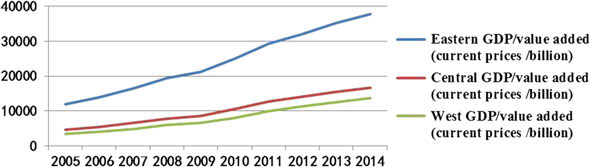
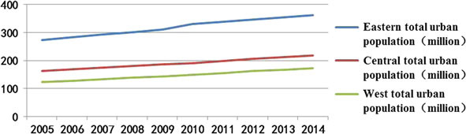
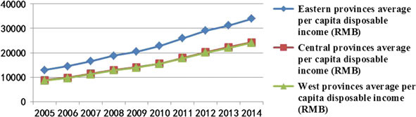
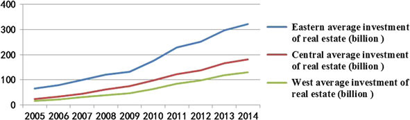
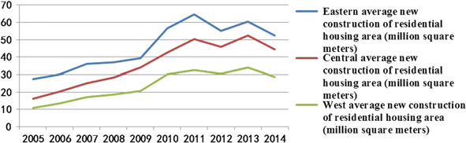
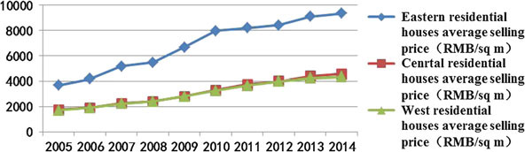

# 翻译：基于省面板数据分析的中国中西部地区住宅房地产价格预测模型研究

### A Study on the Real Estate Price Forecast Model in the Midwest of China—Based on Provincial Panel Data Analysis

## 摘 要

There are a lot of factors that affect the price of commercial house, which is both the demand and supply factors. Based on the analysis of the variable factors of commercial housing price, the average selling price of commercial housing from 2005 to 2014 in the Midwest of China is used as the primary time data series, and the dynamic state forecasting model of the average selling price of commercial housing in the Midwest is established by using multiple regression analysis and trend analysis method.

>影响商品房价格的因素很多，既有供给方的因素，也有需求方的因素。在分析商品住宅价格可变因素的基础上，以中国中西部地区2005年至2014年商品住宅平均销售价格为主要时间数据序列，运用多元回归分析和趋势分析方法建立了商品住宅平均售价动态状态预测模型。

From the results of the model predictions, the commodity residential sales prices in most provinces of the central and western remain upward trend, some remain stable trend, as there is a small number of them are declining trend. Through the judgment of the price trend in the central and western provinces, in favor of individuals and enterprises to invest in the future, in favor of government regulationreasonable prices, and promote the healthy development of the housing industry.

>从模型预测的结果来看，大多数中国中西部省份的商品房销售价格呈上升趋势，一些省份保持稳定趋势，同时少数省份有下降趋势。通过对中西部省份房价走势的预测，有利于个人和企业对未来投资方向的把握，有利于政府合理地调控房地产价格，从而促进房地产产业的健康发展。
>
>**关键字：供求理论；商品房；价格；预测模型**

***

>## 第 1 章 引 言

China’s real estate market has experienced ten years of rapid development, which has been in a rising trend. The current urbanization is still in a steady progress, coupled with the improvement of people’s living standards improve the demand for housing, which has become a reason to continue to look good real estate. However, with the economic growth into the medium speed range from the high speed, the economic growth rate declined from the previous two to 7% digits, the economic downturn led to gradually decline in real estate. Because of the their resources and new urban transformation, there are still a lot of potential demand is not satisfied in the big city, while small and medium-sized inland city have faced large developers disinvestment in many places, their real estate market have also been in trouble, and even the phenomenon of excess housing supply.

>中国的房地产市场在明显的上升趋势中经历了十年快速发展。当前的城市化进程仍在稳步推进，随着人们生活水平的提高，住房需求也随之增加，这也成为房地产继续保持良好状况的原因。但是，随着经济增长速度由高速转为中速，经济增长率从两位数下降至7％，经济下滑导致房地产收益逐步下降。由于资源限制和新城市转型，大城市仍然有很多潜在的需求无法满足，而许多内陆中小城市都面临着大型开发商的撤资，这些城市的房地产市场也都面临挑战，甚至出现房屋供应过剩的现象。

Small and medium-sized city in China is mostly distributed in the central and western regions, facing large enterprises evacuation crisis. In 2015 the country introduced the “along the way” policy, which will give the central and western regions along the city to bring new investment opportunities, whether it will stimulate the region’s housing prices? In addition, China’s current stock market volatility is very large, obviously not a stable investment direction. However, in the face of the central bank to reduce interest rates, the savings is clearly not a wise choice for small and medium-sized cities. How should they keep wealth does not shrink? Therefore, based on these considerations, through the supply and demand theory in the market economy to analyze the factors affecting the real estate prices in the Midwest, to build a forecast model for future housing prices in our country. The purpose is to forecast the future real estate prices in the Midwest of China, hoping for government decision-making, real estate development and investment, personal consumption to provide some useful ideas, suggestions and methods.

>中国中西部地区的大多数中小城市，面临大型企业撤离的风险。 2015年，中国推出了“沿途”政策，这将给城市中部和西部地区带来新的投资机会，但是否会刺激该地区的房价呢？此外，中国目前的股市波动很大，显然不是一个稳定的投资方向。同时，面对中央银行降低利率，储蓄对于中小城市显然也不是明智的选择。他们应该如何保持财富不萎缩？基于这些考虑，本文通过市场经济中的供需理论，分析影响中西部房地产价格的因素，建立我国未来房价的预测模型。目的是预测中国中西部地区未来的房地产价格，希望为政府决策、房地产开发和投资和个人消费提供一些有益的想法、建议和方法。

This paper mainly divides into six parts, the first part mainly introduces the background and practical significance of the research. The second part mainly summarizes domestic and foreign theoretical literature and related forecasting methods; the third part is mainly based on market supply and demand theory, analyzes the main factors affecting the price of commercial housing in China, and the fourth part is mainly to carry out empirical research. The sixth part mainly summarizes and discusses the results of the research.

>本文主要分为六个部分，第一部分主要介绍了研究的背景和现实意义；第二部分主要总结国内外理论文献及相关的预测方法；第三部分主要基于市场供求理论，分析了影响我国商品住宅价格的主要因素；第四部分主要进行实证研究；第五部分就研究所得模型对房地产价格趋势进行预测；第六部分主要总结和讨论研究结果。

***

>## 第 2 章 文献综述

>### 2.1 影响房地产价格因素的文献

From the perspective of equilibrium theory, most economists believe that real estate supply and demand determine the real estate prices, the main factor in real estate prices rising is supply and demand imbalance. Decaro [3] pointed out that the causes of real estate market fluctuations in supply and demand, the vacancy rate, monetary policy, employment level, population structure and trends. Choy [2] using the feature model to find the size of residential property, the higher the floor, the better the viewing angle, the higher the price of housing, while the location of the metro will make a larger premium. Different from the above theory, Johansen [5] argued that the market demand and the building materials are not the determining factor, the expected price is the determining factor prices, which provides the theoretical basis for the later option pricing model.

>在均衡理论方面，大多数经济学家认为房地产供求关系决定了房地产价格，房地产价格上涨的主要因素是供需失衡。Decaro \\(^{[3]}\\) 指出，导致房地产市场供求波动的原因有房屋空置率、货币政策、就业水平、人口结构和人口流动趋势。Choy \\(^{[2]}\\) 使用特征模型得到住宅物业的大小、楼层、视角与住房价格呈正相关关系，而靠近地铁的位置将带来更大的溢价。与上述理论不同，Johansen \\(^{[5]}\\) 认为市场需求和建材不是决定因素，预期价格是价格的决定因素，这为以后的期权定价模型提供了理论基础。

Domestic scholars generally believe that the housing price is determined by market supply and demand, but some scholars believe that due to the inelastic supply of real estate in the short term, so the demand is the major determinant of housing prices. Yao and Huang [12] studied “the relationship between land and housing prices”, they think the premium associated with housing prices, but non-linear relationship, even if land prices, house prices are not necessarily risen. Other costs were tested only Rigid no decline in space, and developers have to unprofitable point, rise in land prices will be fully reflected in the price, the direct cause of rising house prices. Existing housing prices depend on the ability of existing residents pay demand, prices rose mainly due to the demand-driven rather than cost-driven. Zhang and Zhou [13] thought that with the change of the purchase subject, buying motives, needs and values change in function, the impact of changes in customer demand, changes in customer demand affect property values, causing price changes. Degree of realization of real estate value and customer awareness of the value of real estate as well as market supply and demand related. Deng and Li [4] through gray prediction method, the surface of investment demand price fluctuations than the consumer demand for a stronger explanatory power, while the psychological expectations, buyers down payment policy relative to other factors greater impact on prices.

>国内学者普遍认为，住房价格是由市场供求关系决定的，但也有学者认为，由于房地产短期供应缺乏弹性，因此需求是住房价格的主要决定因素。Yao和Huang \\(^{[12]}\\) 研究了“土地和房屋价格之间的关系”，他们认为土地溢价与房屋价格有关，但是非线性关系，即使土地价格上涨，房屋价格不一定上涨。其他成本仅经过检测没有下降的空间，而开发商几乎已经到了无利可图的地步，土地价格的上涨将充分体现在房价中，直接导致房价上涨。Zhang和Zhou \\(^{[13]}\\) 认为，随着购买主体、购买动机、需求和价值功能的转变，以及顾客对财产价值需求的转变，导致房地产价格发生改变。房地产价值的实现程度与客户对房地产价值的意识以及市场供求关系密切。Deng和Li \\(^{[4]}\\) 通过灰色预测法得出，在导致价格波动的因素中，投资需求比消费者需求具有更强的解释力，同时从心理预期来看，购房者的首付政策等其他因素对价格的影响更大。

>### 2.2 房地产价格预测方法的文献

Two basic methods in analysis of the use of foreign scholars on urban housing prices hedonic price methodology and repeat-sale methodology. Changes in prices abroad more in-depth analysis, such as Malpezzi [9] for the price-earnings ratio and price changes obtained by the error correction model the previous price and income changes and short-term effects for the price elasticity of supply weak conclusion. Seko [10] believed that the price of housing and economic fundamentals in Japan each region has a strong correlation. He used the time series model predicting the housing prices selected key indicators include privately owned residential average selling price, household income, population, residential construction area, the consumer price index and the vacancy rate. Anglin [1] introduced the average house price growth rate of lag three period and CPI, mortgage rates and unemployment rates, VAR model, to predict many rounds Rate changes.

>国外学者在城市住房价格分析上的两种基本方法分别是特征价格分析和重复销售（repeat-sales）分析。对房地产价格变化的研究，国外具有更深入地分析，如Malpezzi \\(^{[9]}\\) 通过分析市盈率和房地产价格变动得到的误差修正模型，得到先前的价格和收入变动以及短期影响对于供给价格弹性影响较弱的结论。Seko \\(^{[10]}\\) 认为，日本各个地区的住房价格和经济基本面具有很强的相关性。他使用时间序列模型预测房价，所选的关键指标包括私有住宅的平均销售价格、家庭收入、人口、住宅建筑面积、居民消费价格指数和空置率。Anglin \\(^{[1]}\\) 引入了滞后三阶的平均房价增长率以及CPI、抵押贷款率和失业率的VAR模型，以预测多轮利率的变化。

Domestic scholars on housing prices more, mostly using linear regression, principal component analysis and long-term trends and other methods to study the factors affecting the housing price and the change process. Zhang and Yang [14] established the benchmark land price forecasting model based on BP neural network. Li and Ma [6] used the gray system GM (1, 1) model to predict the real estate prices. Yan [11] selected macroeconomic, financial and other nine categories of indicators to propose the price forecasting model based on TEI@I method. Liu and Wang [7] applied multiple factors regression, state space model and Kalman filter to predict the trend of real estate prices in China. Ma and Liu [8] built DSGE model to reflect the relationship between real estate price fluctuations and monetary policy regulation.

>国内学者对房价的研究较多，大多采用线性回归，主成分分析和长期趋势预测等方法来研究影响房屋价格及其变化过程的因素。Zhang和Yang \\(^{[14]}\\) 建立了基于BP神经网络的基准地价预测模型。Li和Ma \\(^{[6]}\\) 使用灰色系统GM（1，1）模型来预测房地产价格。Yan \\(^{[11]}\\) 选择了宏观经济，金融指数和其他九类指标，提出了基于TEI@I方法的房屋价格预测模型。Liu和Wang \\(^{[7]}\\) 应用多元回归，状态空间模型和卡尔曼滤波器来预测中国房地产价格的趋势。Ma和Liu \\(^{[8]}\\) 建立了DSGE模型来反映房地产价格波动与货币政策调控之间的关系。

In summary, the existing literature when analyzing factors affecting the price of the real estate market are mostly from a macro perspective to study the relationship between price fluctuations and the fundamentals, and not in-depth study of the impact of fluctuations in the price of various regions, and no specific analysis of the scope of the price change, but the impact of the factors that affect the price fluctuations will bring much impact. However, in the context of China’s economy into the new normal, the fluctuations in the real estate specific price range forecast is particularly important, but no longer limited to the analysis of influencing factors. Based on this, we use a simple and practicable forecasting model—multiple regression analysis to explore the main factors affecting prices according to supply and demand in the market economy principle, and regression analysis and trend analysis of these factors to predict the central and western provinces of real estate future price movements.

>总的来说，分析影响房地产市场价格因素的现有文献大多是从宏观的角度研究价格波动与基本面之间的关系，而不是深入研究各个地区价格波动相互之间的影响，以及没有具体分析价格变化的范围。但是，在中国经济进入新常态的背景下，房地产特定价格范围的波动预测尤为重要，但不再局限于影响因素的分析。在此基础上，我们采用简单实用的预测模型——多元回归分析，根据市场经济原理，根据供求关系探索影响价格的主要因素，并对这些因素进行回归分析和趋势分析，以预测中西部省份 房地产未来价格走势。

***

## 第 3 章 理论基础

In the market mechanism, urban residential real estate prices are mainly determined by the supply and demand of residential, but is the result of urban housing production and related socio-economic factors working together. According to available literature data relating to real estate, this paper according to the real estate demand and supply two perspectives, form Table 3.1 List factors affecting the real estate prices.

>在市场机制下，城市住宅房地产价格主要由住宅的供求关系决定，同时是城市住房生产和相关社会经济因素共同作用的结果。 根据与房地产有关的现有文献数据，本文从房地产供需两个角度，形成表3.1列出影响房地产价格的因素。

**Table 3.1** List of factors affecting real estate prices

| Level indicators | Secondary indicators        | Three indicators                             |
| :--------------- | :-------------------------- | :------------------------------------------- |
| Housing demand   | Early economic situation    | GDP growth                                   |
|                  |                             | Budget expenditure                           |
|                  |                             | Financial and tax revenue                    |
|                  | Future changes in value     | Year RMB deposit interest rate               |
|                  |                             | Year RMB lending rate                        |
|                  |                             | Shanghai composite index                     |
|                  | The current capacity to pay | Number of urban population                   |
|                  |                             | Urban residents per capita disposable income |
| Housing supply   | Volume and price level      | Commercial housing development investment    |
|                  |                             | Average selling price of commercial housing  |
|                  |                             | Commercial housing new construction area     |
|                  |                             | Commercial housing sales area                |
|                  |                             | Commercial housing vacancy rate              |
|                  | Construction costs          | Cement prices                                |
|                  |                             | Steel prices                                 |
|                  |                             | Building materials purchase price index      |
|                  | Other factors               | Policy factors                               |
|                  |                             | Social customs                               |

*Note* GDP represents GDP growth, POPUL represents Number of urban population, PCDI represents Urban residents per capita disposable income, INVEST represents Commercial housing development investment, ASP represents Average selling price of commercial housing, NCA represents Commercial housing new construction area

**表 3.1** 影响房地产价格的因素

| 一级指标 | 二级指标       | 三级指标               |
| :------- | :------------- | :--------------------- |
| 住房需求 | 早期经济状况   | GDP增长                |
|          |                | 预算支出               |
|          |                | 财政税收               |
|          | 未来价值变动   | 年人民币存款利率       |
|          |                | 年度人民币贷款利率     |
|          |                | 上证综指               |
|          | 当前的支付能力 | 城市人口数量           |
|          |                | 城市居民人均可支配收入 |
| 房屋供应 | 数量和价格水平 | 商品房开发投资         |
|          |                | 商品房平均售价         |
|          |                | 商品房新建筑面积       |
|          |                | 商品房销售区           |
|          |                | 商品住房空置率         |
|          | 建设成本       | 水泥价格               |
|          |                | 钢价                   |
|          |                | 建材购进价格指数       |
|          | 其他因素       | 政策因素               |
|          |                | 社会习俗               |

>注：GDP代表GDP增长，POPUL代表城镇人口数量，PCDI代表城镇居民人均可支配收入，INVEST代表商品住宅开发投资，ASP代表商品住宅平均售价，NCA代表商品住宅新建筑面积

Taking into account the availability of relevant data, the data can be quantified and missing data for some variables in a given year, so we choose GDP, POPUL, PCDI, INVEST, NCA as explanatory variables in the regression model, select ASP as a regression model explanatory variables.

>考虑到相关数据的可用性，可以对给定年份中某些变量的数据进行量化和缺失数据，因此我们在回归模型中选择GDP，POPUL，PCDI，INVEST，NCA作为解释变量，选择ASP作为回归 模型解释变量。

***

## 第 4 章 研究方法

This article does not select the VAR model, gray system GM (l, l) model or BP neural network models and other complex model, but choose a more simple and practical multivariate regression model. Multivariate linear regression analysis is assumed to be linear relationship between the dependent variable and the independent variable, using the mathematical statistics method to construct the empirical formula of the variables and to determine model parameters. The model is considered to be the following three reasons: first, to find the appropriate mathematical expression between variables and the explanatory variables. Second, to determine the influence coefficient of the explanatory variables to the explanatory variables. Third, according to the numerical value of multiple explanatory variables to predict or control the numerical value of the variable. Before making regression analysis, in order to simplify the problem, we have the full regression model, without using stepwise regression analysis on the price of each factor screening and contribution of each factor regression significance for inspection, that we consider only whether the overall linear regression equation significantly. Therefore, we need to make some assumptions:

1. No major change in policy towards the country’s future real estate industry or macro-control measures.
2. ASP can reflect the average price level of real estate in the provinces.
3. We only consider five factors above influence on prices, other factors are negligible.
4. Among these five factors affect the price independent of each other, between two unrelated.
5. Between the factors and the rate is linear relationship

>本文没有选择向量自回归模型，灰色系统GM(1,1)模型或BP神经网络模型等其他复杂的模型，而是选择了更简单和实用的多元回归模型。多元线性回归分析假定因变量与自变量之间的关系为线性关系，用这个数学统计方法去构建有关这些变量的经验方程及确定模型的参数。这个模型被考虑的三个原因是：第一，为了找到其他变量与解释变量合适的数学表达式；第二，为了确定其他变量对解释变量间的影响系数；第三，根据多个解释变量的数值去预测或控制变量的数值。在进行回归分析之前，为了简化问题，我们使用完全回归模型，而不是使用分步回归分析对每个因素进行价值筛选和回归检验，因此我们只需要考虑整个线性回归方程是否显著。在此基础上，我们需要做出一些假设：
>
>1. 国家未来关于房地产的政策和宏观调控政策没有大幅度的变化；
>2. ASP可以反映这些省份的平均价格水平；
>3. 只考虑五个对价格有影响的因素，并忽视其他因素；
>4. 这五个因素对于房屋价格的影响是相互独立的，任意两者不相关；
>5. 各因素与房屋价格呈线性关系。

### 4.1 研究对象

According to China’s administrative division, our country has been divided into three regions in eastern, central and western. Eastern China including Beijing, Tianjin, Shanghai, Liaoning, Hebei, Shandong, Jiangsu, Zhejiang, Fujian, Guangdong, Hainan. Central China including Shanxi, Jilin, Heilongjiang, Anhui, Jiangxi, Henan, Hubei, Hunan.West China including Guangxi, Chongqing, Sichuan, Guizhou, Yunnan, Shaanxi, Gansu, Ningxia, Qinghai, Xinjiang, Inner Mongolia, Tibet.

>根据中国官方的划分，我们的国家被分成三个区域：西部、中部、东部。中国东部包括北京、天津、上海、辽宁、河北、山东、江苏、浙江、福建、广东、海南。中国中部包括山西、吉林、黑龙江、安徽、江西、河南、湖北。中国西部包括广西、重庆、四川、贵州、云南、陕西、甘肃、宁夏、青海、新疆、内蒙古、西藏。

The main object of this study is the central and western provinces 2005–2014 years of commodity price levels of residential houses, and the data comes from the EPS database, the Chinese Statistical Yearbook and the statistical yearbook of the provinces. According to literature data indicate that reflect the level of real estate prices, usually commercial housing sales price index or commodity residential average selling price (sales of commercial residential / commercial residential sales area), commercial housing sales price index is a comprehensive reflection of the overall level of residential commodity prices changes and changes in the relative number of changes. In this paper, commodity residential average selling price is interpreted as the dependent variable, more intuitive to show the level of housing prices, more conducive to individual and corporate investment decisions.

>本文的主要研究对象为中西部地区2005-2014年度居民商品房价格水平，数据来源与EPS数据库、中国统计年鉴与各省份的统计年鉴。根据文献资料表明，反映房地产价格水平的，通常是住宅销售价格指数或商品住宅平均销售价格（商品住宅销量价格/商品住宅销售面积），商品房销售价格指数是对住宅商品房价格总体水平变化和相对变化在数量上的综合反映。本文将商品住宅的平均售价解释为因变量，更直观地显示出房价水平，更有利于个人和企业的投资决策。

### 4.2 数据描述

#### 4.2.1 中国各区域GDP比较

As shown in Fig. 45.1, the eastern GDP gross domestic product has maintained a rapid growth, and probably will leap to a higher level every four years, to new heights. At the same time, GDP in central and western China’s GDP has been lagging behind in the eastern region, and around the eastern half of the total, Midwest GDP growth gradually narrowing the gap.

**fig 4.1** 中国各区域GDP比较

>正如图4.1所示，东部地区的GDP保持了快速增长，并且可能每四年就会跃升到一个新的高度。同时，中国中西部地区的GDP落后于东部地区，并大约只有东部地区总额的一半，中西部地区GDP的增长正在逐渐缩小差距。

#### 4.2.2 中国各区域城镇居民人口比较

As shown in Fig. 45.2, due to the rapid economic development in Eastern China, the location and number of the urban population is more than the Midwest. Central and Western China due to economic development is lagging behind, a relatively small number of urban population, while in western China because of geographical reasons, the total urban population of the west less than the east.

**fig 4.2** 中国各区域城镇居民人口比较

>正如图4.2所示，由于中国东部地区经济快速发展，其城镇人口的居住区域和数量高于中西部地区。中国中西部由于经济发展落后，城镇人口相对较少，同时由于中国西部的地理原因，西部的城镇人口少于东部地区。

#### 4.2.3 中国各区域人均可支配收入比较

As shown in Fig. 45.3, the provinces per capita disposable income radiate upward trend, but the gap between the eastern and mid-western per capita disposable income is gradually widening, people in western and central part of the gap in per capita disposable income decreases, and the per capita disposable income in the East is slightly higher than the midwest.

**fig 4.3** 中国各区域人均可支配收入比较

>正如图4.3所示，各省人均可支配收入呈放射状上升趋势，各省人均可支配收入呈放射状上升趋势，但东部和中西部人均可支配收入差距逐渐扩大，西部和中部地区人均可支配收入差距缩小，人均可支配收入东部略高于中西部。

#### 4.2.4 中国各区域住宅房地产投资比较

As shown in Fig. 45.4, our country from 2009, the real estate yield residential investment showed a rising trend in the provinces. Because of the advantages of its geographical location and area, the real estate investment in East has maintained rapid growth. Property investment growth rate in the central and westernmore gentle, the central provinces where the average residential investment more than the west, which may be due to the central flat, relatively dense population.

**fig 4.4** 中国各区域住宅房地产投资比较

>正如图4.4所示，我国从2009年开始，房地产投资住宅的收益率在各省呈上升趋势。由于其地理位置和面积的优势，东部的房地产投资一直保持快速增长。中部和西部的房地产投资增速较为平缓，中部省份的平均住宅投资高于西部，这可能是由于中部地区平坦，人口相对密集。

#### 4.2.5 中国各区域新建住宅面积比较

As shown in Fig. 45.5, the new construction of residential houses of each region from 2005 to 2008 has maintained steady growth, from 2009 to 2011 residential houses spurt of growth, and peaked in 2011, after 2011 new houses the area began to reduce. Particularly, in 2014 the new construction of residential housing area significantly reduced trend. Overall, China’s new residential housing area due to the impact of national policies, the emergence of growth trajectory fluctuations style.

**fig 4.5** 各区域新建住宅面积比较

>正如图4.5所示，2005年至2008年，每个地区的新建住宅建设均保持稳定增长，2009年至2011年住宅增长突飞猛进，并在2011年达到顶峰后，2011年新住宅面积开始减少。特别是2014年，新建住宅面积明显减少。总体而言，中国的新住宅面积由于国家政策的影响，出现了增长轨迹的波动形式。

#### 4.2.6  中国各区域住宅平均销售价格比较

As shown in Fig. 45.6, prices in eastern China is almost twice around theMidwest, which may be related to the degree of economic development in the east, population density, geographical and other factors. West and central regions Rate has been synchronized growth trend, and housing prices in these two regions remain flat state.

**fig 4.6** 中国各区域住宅平均销售价格比较

>正如图4.6所示，中国东部地区的价格几乎是中西部地区的两倍，这可能与东部地区的经济发展程度，人口密度，地域因素等有关。西部和中部地区房价一直呈同步增长趋势，这两个地区的房价保持平稳状态。

### 4.3 数据分析

In this paper, the regression equation was constructed as follows multiple regression model based on the content and assumptions discussed above:

\\[ ASP = \beta_0 + \beta_1GDP + \beta_2POPUL + \beta_3PCDI + \beta_4INVEST + \beta_5NCA + \mu\\] 

Amongthem, the variableASP is interpreted to represent the average selling price of commercial housing, the explanatory variables GDP represents GDP growth, POPUL represents the number of urban population, PCDI represents the per capita disposable income of urban residents, INVEST represents the development of commercial housing investment, NCA represents Commercial housing new construction area. In this paper, EVIEWS8.0 software is used to analyze the model, according to Table 45.2 to determine the overall value of the linear regression equation of the relationship is significant.

本文基于上述内容和假设，按以下多元回归模型构建了回归方程：

\\[ ASP = \beta_0 + \beta_1 GDP + \beta_2 POPUL + \beta_3 PCDI + \beta_4 INVEST + \beta_5 NCA + \mu \\]

其中ASP为平均销售价格；GDP为国内生产总值；POPUL为城镇居民人数；PCDI为人均可支配收入；INVEST为住宅商品房投资金额；NCA为新建住宅商品房面积。在本文中，用EVIEWS8.0软件对模型进行分析，根据表4.1确定该线性回归方程的整体值之间的关系是是显著的。

**表 4.1** 在本文中，中西部房价回归的显著性

|  省份  |  R2   | 调整R2 |   F    |   P   |  DW   | 显著性 |
| :----: | :---: | :----: | :----: | :---: | :---: | :----: |
|  山西  | 0.99  |  0.98  | 73.96  |   0   | 2.23  |   真   |
|  吉林  | 0.97  |  0.94  | 30.53  |   0   | 1.63  |   真   |
| 黑龙江 | 0.99  |  0.98  | 91.08  |   0   | 2.82  |   真   |
|  安徽  | 0.99  |  0.98  | 89.94  |   0   | 2.53  |   真   |
|  江西  |   1   |  0.99  | 247.42 |   0   | 3.23  |   真   |
|  河南  |   1   |  0.99  | 261.76 |   0   | 2.31  |   真   |
|  湖北  | 0.99  |  0.97  | 65.45  |   0   | 2.93  |   真   |
|  湖南  | 0.99  |  0.98  | 104.69 |   0   | 2.79  |   真   |
|  广西  |   1   |  0.99  | 264.31 |   0   | 2.64  |   真   |
|  重庆  | 0.99  |  0.99  | 122.57 |   0   | 2.76  |   真   |
|  四川  | 0.98  |  0.95  | 32.29  |   0   | 1.58  |   真   |
|  贵州  | 0.99  |  0.98  | 83.21  |   0   | 1.78  |   真   |
|  云南  |   1   |  0.99  | 179.92 |   0   | 1.92  |   真   |
|  陕西  | 0.99  |  0.98  | 79.13  |   0   | 2.99  |   真   |
|  甘肃  | 0.97  |  0.93  | 25.29  |   0   |  2.8  |   真   |
|  宁夏  | 0.98  |  0.96  | 41.35  |   0   | 2.92  |   真   |
|  青海  | 0.99  |  0.99  | 141.29 |   0   |  2.6  |   真   |
|  新疆  | 0.99  |  0.99  | 130.83 |   0   | 2.36  |   真   |
| 内蒙古 |   1   |   1    | 388.33 |   0   |  2.3  |   真   |

***

## 第 5 章 趋势预测

In this paper, before forecasting the Midwest provinces housing prices trend, you need to set composed of five explanatory variables W = (GDP, POPUL, PCDI, INVEST, NCA) prediction model, and then predict the value of each index into the measuring income the regression model to predict housing prices. In predicting the explanatory indicators, due to the presence of non-linear argument may change with time curve, so using curve estimation can make the difference between actual data and theoretical data as small as possible. If the curve selection is good, it can better reflect the inner relationship between the variables and the independent variables, and the prediction of the dependent variable has a certain significance.

>在本文中，在预测中西部价格上涨趋势之前，需要设置由五个解释变量W=（GDP，POPUL，PCDI，INVEST，NCA）组成的预测模型，然后将每个指数的价值预测到衡量收入的回归模型中，以预测住房价格。在预测解释性指标时，由于非线性自变量的存在可能会随时间曲线而变化，因此使用曲线估计可以使实际数据与理论数据之间的差异尽可能小。如果曲线选择良好，则可以更好地反映变量与自变量之间的内在联系，对因变量的预测具有一定的意义。

In this paper, we use a variety of general simulation forecasting methods, and compare the results of the calculation. According to the value of the coefficient, we can choose the optimal curve estimation model. Then you can obtain the predicted value of each index by calculating the interpretation model. Finally, the predictive value of each interpreted indexes into the regression equation, you can get Table 45.3 in the central and western provinces of the next three years of real estate forecast value.

>在本文中，我们使用了多种通用的模拟预测方法，并比较了计算结果。根据系数的值，我们可以选择最佳曲线估计模型。然后可以通过计算解释模型来获得每个指标的预测值。最后，将每个解释指标的预测值代入回归方程，可以得到表5.1在未来三年中部和西部省份的房地产预测值。

**表 5.1** 中国中西部住宅平均售价预测（单位：元）

|  省份  |   2014   |  2015   |  2016   |  2017   | 趋势  |
| :----: | :------: | :-----: | :-----: | :-----: | :---: |
|  山西  | 4,462.00 | 5052.78 | 4979.52 | 5336.23 | 上升  |
|  吉林  | 4,810.00 | 5544.81 | 6215.36 | 6945.62 | 上升  |
| 黑龙江 | 4,517.00 | 4315.49 | 3466.16 | 1775.13 | 下降  |
|  安徽  | 5,017.00 | 5030.58 | 4813.23 | 4264.45 | 下降  |
|  江西  | 4,971.00 | 5360.95 | 5354.03 | 5104.16 | 平稳  |
|  河南  | 3,909.00 | 4573.12 | 5111.55 | 5697.72 | 上升  |
|  湖北  | 5,085.00 | 5280.68 | 5401.68 | 5396.2  | 平稳  |
|  湖南  | 3,830.00 | 3976.33 | 3762.25 | 3345.22 | 下降  |
|  广西  | 4,442.00 | 4799.62 | 5143.02 | 5505.7  | 上升  |
|  重庆  | 5,094.00 | 5108.99 | 4734.39 | 4051.17 | 下降  |
|  四川  | 5,092.00 | 5155.31 | 5000.83 | 4653.68 | 平稳  |
|  贵州  | 3,694.00 | 3570.15 | 2958.95 | 1921.47 | 下降  |
|  云南  | 4,451.00 | 5015.19 | 5521.67 | 6085.51 | 上升  |
|  陕西  | 4,823.00 | 4560.04 | 3719.8  | 2387.98 | 下降  |
|  甘肃  | 4,234.00 | 5118.62 | 6077.87 | 7301.83 | 上升  |
|  宁夏  | 3,747.00 | 3757.27 | 3356.41 | 2686.79 | 下降  |
|  青海  | 4,294.00 | 4869.12 | 5475.11 | 6194.21 | 上升  |
|  新疆  | 4,057.00 | 4627.25 | 5031.55 | 5446.43 | 上升  |
| 内蒙古 | 3,833.00 | 4477.49 | 4617.53 | 4646.09 | 上升  |

From Table 45.3, it can be concluded that the forecast value of themodel is consistent with the actual price level in 2015, but after two years, the price level fluctuations may have a large deviation with the real value. Therefore, the predicted value after only two years as a judge future price movements of a signal, specific value may be due to changes in various indicators have a greater change.

>从表5.1可以得出结论，该模型的预测值与2015年的实际价格水平一致，但在两年后，价格水平的波动可能与实际价格有较大的偏差。 因此，仅仅以两年后的预测值作为判断未来价格走势的信号，真实值也可能由于各项指标变化产生较大变化。

***

## 第 6 章 总 结

At present, domestic and foreign literature mainly using time series models, neural network forecasting model, gray forecast model from a macro perspective to analyze the relationship of the rates and fundamentals. In this paper, based on the theory of supply and demand in themarket economy, to select fivemain factors affecting prices, through the use of traditional regression model and trend analysis from a microscopic perspective of future price movements in central and western provinces, in order to guide individuals and businesses better investment to better serve the economic development of the city. However, this article mainly because of limited data, the prices forecast does not consider the cost of construction, local policy, the current bank interest rates, inflation and so on, so the forecast value is only as an auxiliary tool to judge the trend of prices.

>目前，国内外文献主要使用时间序列模型，神经网络预测模型，灰色预测模型从宏观角度分析利率与基本面的关系。本文基于市场经济中的供需理论，通过使用传统回归模型和趋势分析从中西部省份未来价格走势的微观角度选择影响价格的五个主要因素，以期引导个人和企业更好的投资，更好地服务于城市的经济发展。但是，本文主要是由于数据有限，价格预测未考虑建设成本，地方政策，当前银行利率，通货膨胀等因素，因此预测值仅作为判断价格趋势的辅助工具。

Of course, there are many factors that affect the price. For example, scholars often discuss the money supply, tax policy, loan interest rates, land policy, and so on, in addition to the current Chinese real estate purchase real name system, personal property registration system, new urbanization of migrant workers’ housing demand, these new changes in how to affect the trend of housing prices need to further explore the study. However, with the continuous supply of affordable housing, limited credit, restriction and a series of macro-control policies and the introduction of the national economic growth mode change, we believe that price increases will become increasingly smaller and eventually easing.

>当然，有很多因素会影响价格。例如，学者们经常讨论货币供应，税收政策，贷款利率，土地政策等等，除了当前的中国房地产购买实名制，个人财产登记制度，新的农民工住房需求城市化，这些新变化如何影响房价走势需要进一步研究。然而，随着经济适用房的持续供应，有限的信贷，限制和一系列宏观调控政策以及国家经济增长方式的改变，我们认为价格上涨幅度将越来越小，并最终得到缓解。

## 参考文献

[1] Anglin P (2006) Local dynamics and contagion in real estate markets. In: The international conference on real estates and macro economy, Beijing, pp 19–24

[2] Choy LH, Mak SW, Ho WK (2007) Modeling Hong Kong real estate prices. J Hous Built Environ 22(4):359–368

[3] Decaro SW (1997) Correlations and copulas for decision and risk analysis. Manag Sci45(2):208–224

[4] Deng X, Li S (2015) Consumer demand, investment demand and housing price fluctuations. Southwest Univ Natl (Humanit Soc Sci) 10:99–103 (in Chinese)

[5] Johansen S (1988) Statistical analysis of cointegration vectors. J Econ Dyn Control 12(2):231–254

[6] Li D, Ma Z (2006) Grey GM (1,1) model in house price forecasting algorithm research. Enterp Econ 9:96–98 (in Chinese)

[7] Liu D, Wang W (2008) Key drivers and future trends of housing prices in China. Manag Rev 9:3–10 (in Chinese)

[8] Ma Y, Liu C (2014) China’s real estate market price fluctuation and the monetary policy based on the numerical simulation of the DSGE model analysis. Tianjin Univ Financ Econ 1:40–50 (in Chinese)

[9] Malpezzi S (1999) A simple error correction model of house prices. J Hous Econ 8(1):27–62

[10] Seko M (2006) Housing prices and economic cycles. In: The international conference on housing market and the macro economy, Beijin, pp 19–24 (in Chinese)

[11] Yan Y, Wei X et al (2007) Method for housing price forecasting based on TEI@I methodology. Syst Eng-Theory Pract 27(7):1–9

[12] Yao X, Huang W (2001) Land and housing relationship. Real Estate Market 9:33–35 (in Chinese)

[13] Zhang D, Zhou L (2004) The impact of customer demand on real estate prices. Real Estate Market 4:58–60 (in Chinese)

[14] Zhang P, Yang H (2000) Study on the benchmark land price prediction model based on neural network. China Land Sci 9:33–35 (in Chinese)
